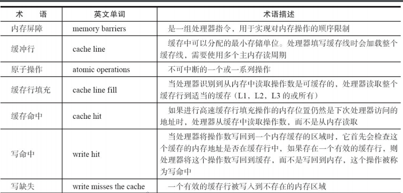
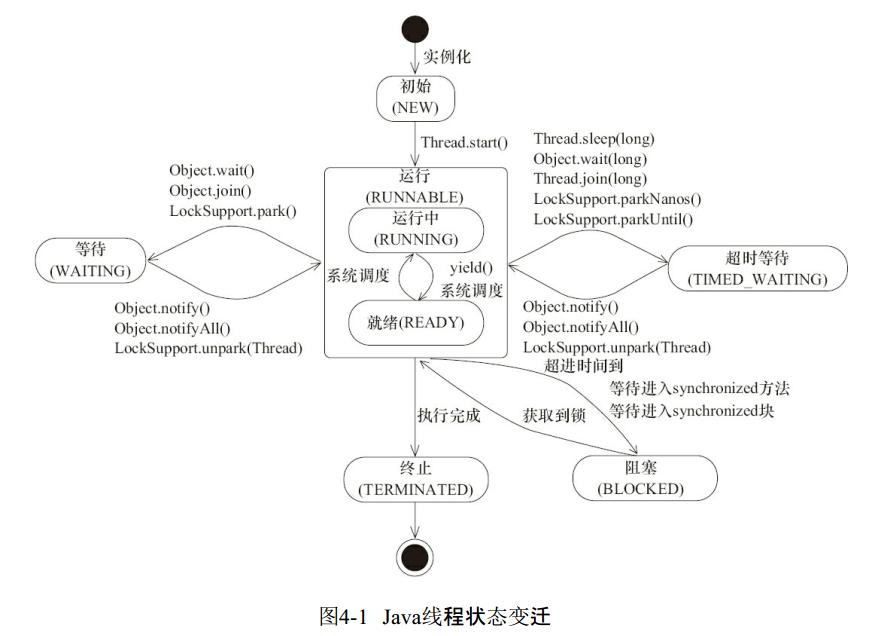

# 并发编程艺术 {ignore}
[toc]

## 第一章 并发编程的挑战

### 1.1 上下文的切换

即使单核处理器支持多线程执行代码，CPU通过给每一个线程分配CPU时间片（几十ms）段来实现多线程的机制。来回切换线程（保存和加载过程）会有开销。

### 1.2 死锁
定义：两个或多个线程同时等待对方释放锁时，会产生死锁。
避免方法：
- 避免一个线程同时获得多个锁。
- 避免一个线程在锁内同时占用多个资源，尽量保证一个锁只占用一个资源。
- 使用定时锁，lock.tryLock(timeout)。
- 对数据库锁，加锁和解锁必须在一个数据库连接里，否则会出现解锁失败的情况。

### 1.3 资源限制

## 第二章 java并发机制的底层实现原理
java代码编译后会变成字节码，字节码被类加载器加载到JVM里，JVM执行字节码最终转化为汇编在CPU上执行。

### 2.1 volatile的应用

1. colatile的定义与实现原理
- 定义：如果一个变量被声明为volatile,所有线程看到这个变量的只是一致的。

CPU的术语定义


- 实现原理：
在对声明了volatile变量进行读写操作时，JVM会向处理器发送一条Lock前缀指令，Lock前缀指令的作用：
（1）Lock前缀指令会引起处理器将缓存写到内存中。
（2）一个处理器的缓存写到内存会导致其他处理器的缓存无效。

2. volatile 的使用优化
**一个对象引用占四个字节**
追加64个字节能够提高并发效率，因为追加64个字节使得队列的头和尾不在同一个高速缓存行内，修改头或尾时只会锁定整个缓冲行，从而使得一个队列的头和尾可以同时被访问修改。

### 2.2 synchronized的实现原理
**重量级锁**
- synchronized实现同步的基础：java中的每一个对象都可以作为锁。
    - 对于普通同步方法，锁时当前**实例对象**
    - 对于静态同步方法，锁是当前类的**class对象**
    - 对于同步方法块，锁是**Sychronized括号里面配置的对象**
    当以一个线程访问同步代码块时，他首先需要获得锁，退出或抛出异常时必须释放锁。

JVM基于进入和退出Monitor对象来实现方法同步和代码块同步。但实现细节不一样，代码块同步是使用monitorenter和monitorexit指令来实现。
monitorenter指令在编译后插入到同步代码块开始位置，而monitorexit指令插入到方法借宿和异常出，jvm要保证每一个monitorenter必须有一个对应的monitorexit与之配对。任何一个对象都有一个monitor与之关联，当一个monitor被持后，它将处与锁定状态。线程执行到monitorenter指令时，将会尝试获取对应monitor的所有权，即尝试获得对象的锁。

&emsp;&emsp;**总结：sychronized关键字会使得代码在编译后将插入monitorenter和monitorexit指令。每一个对象都有与之关联的monitor对象，当线程执行到monitorenter指令时，将会尝试获取monitor的所有权，即获得锁，执行到monitorexit时，将会释放锁。monitorenter与monitorexit成对存在。**

2.2.1 Java对象头
&emsp;&emsp;sychronized用的锁是存在Java对象头里面的。
数组对象头：3个字宽存储对象头 32位虚拟机一个字宽4个字节。
非数组对象：2个字宽存储对象头 64位虚拟机一个字宽8个字节

2.2.2 锁的升级
为减小获得锁和释放锁带来的性能消耗，1.6以后引入偏向锁和轻量级锁。
锁的级别：无锁状态$\longrightarrow$偏向锁状态$\longrightarrow$轻量级锁状态$\longrightarrow$重量级锁状态。
**随竞争激烈程度提升，但只能升级，不能降级**
1. 偏向锁
当一个线程来访问锁时，会在头对象和栈帧中的所记录里存储锁偏向的线程ID，以后该线程在进入和退出同步代码块时不需要尽进行Compare and Swap（CAS）操作来加锁解锁。只需测试对象头中的MARk Word里是否存储着指向当前线程的线程锁。如果测试成功，则表示该线程已经获得锁，如果测试失败，则测试Mark Word中的偏向锁标识是否设置为1，若果没有，则使用CAS竞争锁，如果设置了，则尝试使用CAS将对象头指向该线程。
-偏向锁的撤销
当有其他线程尝试竞争锁的时候偏向锁的持有线程才会释放锁，偏向锁的撤销需要在全局安全点（没有字节码执行）时间上才能进行。
2. 轻量级锁
- 轻量级加锁：
在线程在执行同步代码块之前，JVM会现在当前线程的栈帧中创建用于存储所记录的空间，并且将对象头中的MArk Word复制到锁记录中。然后线程尝试使用将CAS将对象头中的Mar看word替换成指向锁记录的指针。若果成功，当前线程获得锁，否则表示其他线程竞争锁，当前线程便尝试使用自旋来获取锁。
**每一个访问同步代码块的线程，将对象头中的Mark Word复制到线程的Display Mark word 中，成功则获得锁，否则自选取锁。**
- 轻量级解锁：
轻量级解锁时，会使原子的CAS操作将会Display Mark Word替换回到对象头Mark Word，若果成功，则表示没有竞争发生。若果失败，则表示当前锁存在竞争，锁就会膨胀成重量级锁。
**当某个线程执行完同步体后，会将Display Mark Word替换到对象头的Mark Word，若果没有线程竞争，则直接替换成功，否则替换失败，升级为重量级锁**

锁的优缺点：
锁|优点|缺点|适应场景
:-:|:-:|:-:|:-:
偏向锁|加锁解锁不需要额外消耗，执行同步代码块和非同步代码块相比仅存在纳秒级差别|若果出现锁的竞争，会带来额外撤销消耗|单线程访问同步代码块场景
轻量级锁|竞争时线程不会阻塞，提高程序的相应速度|若果始终无法获取锁则会消耗CPU资源|追求响应时间同步代码块执行速度非常快
重量级锁|竞争线程不适用自旋，不会消耗CPU|线程阻塞，相应时间缓慢|追求吞吐量，同步代码块执行速度较慢

### 2.3 原子操作的实现原理
原子操作：不可中断的一个或一系列操作
1. 术语定义

术语名称|解释
:-:|:-:
缓存行|缓存的最小操作单位
比较和交换|CAS操作，比较新旧数值是否有变化，有则发生交换
CPU流水线|指令处理流水线，一个CPU时钟内完成一条指令
内存顺序冲突|一般由假共享引起，假共享是指多个CPU同时修改同一缓存行的不同部位而引起其中一个CPU的操作无效，当出现内存顺序冲突时，CPU必须清空流水线

2. 处理器如何实现原子操作
32位IA-32处理器使用基于对**缓存加锁**和**总线加锁**的方式来实现多处理器之间的原子操作。
- 总线加锁：当一个线程处理一个变量时，会在总线上释放一个lock信号，当其他处理器请求访问内存时会被阻塞，实现独占共享资源。（**大家都别取数据**）
- 缓存锁定：锁定缓存行，执行完操作时修改内部的内存地址，并使用缓存一致性时其他CPU缓存无效。

CAS实现原子操作的三大问题
(1) ABA问题，解决：在变量前追加版本号
(2) 循环时间长，开销大。如果自旋CAS长时间不成功，会给CPU带来非常大的执行开销。解决：使用pause指令延时流水线，避免在退出循环因内存冲突引起CPU流水线被清空
(3) 只能保证一个共享变量的原子操作

## 第三章 java内存模型

### 3.1 Java内存模型的基础
3.1.1 并发模型的两个关键问题
线程间的**通信**和**同步**问题。
线程通信机制：
- 共享内存：公共状态
- 消息传递：线程之间发送消息

- 同步：用于控制不同线程间发生相对顺序的机制

3.1.2 Java内存模型的抽象结构
所有示例，静态域和数组元素都存在堆中，对在线程之间共享。
局部变量，方法定义参数和异常处理参数不会在线程之间共享，每一个线程都有自己的本地内存（local memory）存放共享变量的副本，本地内存是JVM的一个抽象概念，并不是真实的存在的。

3.1.3 从源代码到指令序列的重排序
（1）编译器优化的重排序，编译器在不改变单线程语义的情况下，可以重新安排语句顺序。
（2）指令级并行的重排序
（3）内存系统的重排序

3.1.4 并发编程的模型分类

3.15. happens-before：前一个操作（执行结果）对后一个操作可见。

### 3.2 重排序
编译器和处理器为优化程序性能而对指令进行重排序。
3.2.1 数据依赖性
若果两个操作同时访问同一个变量，而这两个操作有一个为写操作，则这两个操作之间存在数据依赖。

3.2.2 as-if-serial语义：不管怎么重排序（单线程）程学的执行结果不能改变。
编译器和处理器不会对存在数据依赖的操作进行重排序。

3.2.4 多线程中，若存在控制依赖的操作重排序，可能会改变程序的执行结果。

### 3.3 顺序一致性
3.3.1 数据竞争：一个线程写一个变量的同时另一个线程读同一个变量，并且读写没有同步排序。
3.3.2 顺序一致性内存模型
- 一个线程中的所有操作必须按照程序的顺序来执行
- 不管是否同步，所有线程都只能看到一个单一的操作顺序，在顺序一致性模型中，每一个操作都必须是原子执行并且对所有线程可见。（任何时间只能有一个线程能够连接到该内存）。

**JVM中语序临界区内重排序**

3.3.4 最小安全性
JVM不保证未同步程序的执行结果和该程序在顺序一致性模型中的执行结果一致。保证执行结果一致需要禁止大量的编译器，处理器的优化。

每次处理器的和内存之间的数据传输都是通过一系列步骤来完成：总线事务。总线会同步试图并发执行的总线事务。

### 3.4 volatile 的内存语义
volatile声明的变量，可以看成对改变量的单个读写做了同步。
具有特性：
- 可见性
- 原子性

当写一个volitile变量时，JVM会把该线程的本地缓存共享变量刷新到主内存
当读一个volatile变量时，JVM会对应本地的内存无效化。

3.4.4 内存语义的实现
屏障插入策略：（防止重排序影响结果）
·在每个volatile写操作的前面插入一个StoreStore屏障。
·在每个volatile写操作的后面插入一个StoreLoad屏障。
·在每个volatile读操作的后面插入一个LoadLoad屏障。
·在每个volatile读操作的后面插入一个LoadStore屏障。


### 3.5 锁的内存语义

3.5.1 锁的释放-获取建立的happens-before的关系
锁除了让临界区互斥执行以外，还可以让释放锁的线程向获取同一锁的线程发送消息。

**锁的释放和获取总结**
- 线程a释放一个锁，实质上是线程a向接下来要获取这个锁的某个线程发出了信息（a线程对共享变量锁做的修改）
- 线程b获得锁，实质上是线程b接受到某线程发出释放锁的消息（修改消息）

3.5.3 
- lock指令执行时会锁住总线。
- 禁止该指令与之前和之后的续写指令进行重排序
- 刷新缓存

### 3.6 final域的内存语义
3.6.1 final域的重排序规则
（1）在构造函数内对一个final域的写入，与之随后把这个被构造对象的引用赋值给一个变量，这两个操作不可重排序。
（2）初次读一个包含final域的引用，与随后初次读这个final域，这两个操作之间不能重排序

### 3.7 happens-before
JMM向程序员提供的happens-before规则
JMM其实是在遵循一个基本原则：只要不改变程序的执行结果（指的是单线程程序和正确同步的多线程程序），
编译器和处理器怎么优化都行。

3.7.3 happens-before规则
1）程序顺序规则：一个线程中的每个操作，happens-before于该线程中的任意后续操作。
2）监视器锁规则：对一个锁的解锁，happens-before于随后对这个锁的加锁。
3）volatile变量规则：对一个volatile域的写，happens-before于任意后续对这个volatile域的
读。
4）传递性：如果A happens-before B，且B happens-before C，那么A happens-before C。
5）start()规则：如果线程A执行操作ThreadB.start()（启动线程B），那么A线程的
ThreadB.start()操作happens-before于线程B中的任意操作。
6）join()规则：如果线程A执行操作ThreadB.join()并成功返回，那么线程B中的任意操作
happens-before于线程A从ThreadB.join()操作成功返回。

### 3.8 双重检查锁定与延迟初始化
双重检查锁定是常见的延迟初始化技术。

3.8.1 双重检查锁定的由来
有时候可能需要推迟该开销对象的初始化过程，并且只有使用这些对象才进行初始化。


### 3.9 java内存模型总结

3.9.1 处理器的内存模型
顺序一致性内存模型是一个理论参考模型，实际上jvm和处理器会进行重排序，提高执行效率。

## 第四章 java并发编程基础

线程作为操作系统的调度的最小单元。  
### 4.1 线程介绍
4.1.1 什么是线程
启动一个java程序，操作系统就会创建一个java进程。现代操作系统调度的最小单元是线程，也叫轻量级进程。
一个线程可以创建多个线程，每一个线程都有自己的计数器，堆栈和局部变量等属性。并且可以同时访问共享内存变量。
```java
    //获取java线程管理MXBean
        ThreadMXBean threadMXBean = ManagementFactory.getThreadMXBean();
        //不要获取同步的monitor和synchronizer信息，仅获取线程和线程堆栈信息
        ThreadInfo[] threadInfos = threadMXBean.dumpAllThreads(false,false);
        for (ThreadInfo threadInfo :
                threadInfos) {
            System.out.println("[" + threadInfo.getThreadId() + "]" + threadInfo.getThreadName());
        }
```
结果：
[6]Monitor Ctrl-Break
[5]Attach Listener
[4]Signal Dispatcher
[3]Finalizer
[2]Reference Handler
[1]main

4.1.2 为什么要使用多线程
1. 更多的处理核心
2. 更快的响应时间
3. 更好的编程模型

4.1.3 线程的优先级
现代操作系统基本采用**时分形式**调度运行的线程。线程会被系统分配多个时间片段，当先线程的时间片段用完了就会发生线程调度。

java通过 int priority来控制优先级，优先级范围：1-10，在线程构建时可以通过setPriority(int )方法来修改优先级，默认优先级为：5 。

4.1.4 线程的状态
1. NEW:初始状态，线程被构建，但是还没调用start()方法
2. RUNNAble：运行运行状态，java线程将操作系统的就绪状态和运行状态两钟头状态统称为“运行中”
3. BLOCKED：阻塞状态，表示线程阻塞与锁
4. WAITING：等待状态，改状态需要等待其他线程做出一些特定动作（通知或中断）
5. TIME_WAITING：超时等待，指定时间自动返回
6. TERMINATTED：终止状态，表示当前线程已经执行完毕。

线程变迁图：


4.1.5 Daemon线程
Daemon线程是一中支持线程，主要被用于程序后台调度以及支持性工作。

注意：构建Daemon线程时，不能依靠finally来进行资源关闭，因为java虚拟机退出时不会执行Daemon的finally块不会被执行。

### 4.2 启动或终止线程

4.2.2 启动线程
调用start()方法：当前线程（即parent线程）同步告知java虚拟机，只要线程规划器空闲，立即启动调用start()方法的线程。

4.2.3 理解中断
其他线程通过调用该线程的**interrupt()**方法对其进行中断操作。
线程通过检查自己是否被中断来进行响应，通过isInterrupted()方法来进行判断。

4.2.4 过期的suspend()、resume()和stop() 占用资源不释放，容易引起死锁。

4.2.5 通过标志位或中断方式来终止线程，可以让线程在终止时有机会去清理资源，而不是武断的将线程停止，安全退出。

```java
public class Shutdown {
    public static void main(String[] args) throws Exception {
        Runner one = new Runner();
        Thread countThread = new Thread(one, "CountThread");
        countThread.start();
// 睡眠1秒，main线程对CountThread进行中断，使CountThread能够感知中断而结束
        TimeUnit.SECONDS.sleep(1);
        countThread.interrupt();
        Runner two = new Runner();
        countThread = new Thread(two, "CountThread");
        countThread.start();
// 睡眠1秒，main线程对Runner two进行取消，使CountThread能够感知on为false而结束
        TimeUnit.SECONDS.sleep(1);
        two.cancel();
    }
    private static class Runner implements Runnable {
        private long i;
        private volatile boolean on = true;
        @Override
        public void run() {
            while (on && !Thread.currentThread().isInterrupted()){
                i++;
            }
            System.out.println("Count i = " + i);
        }
        public void cancel() {
            on = false;
        }
    }
}
```

### 4.3 线程之间的通信
**每一个线程都有自己的栈空间**

4.3.1 volatile和synchronized关键字
在线程访问一个对象或成员变量时，由于每一个变量都可以拥有这个变量的拷贝，所以线程看到的不一定是最新的变量。

- volatile：告知程序，在任何时候该变量都要从共享空间中获取，改变则必须刷新。
ex：表示程序是否运行的变量boolean on = true;
- synchronized：可以修饰方法或者代码块。只能有一个线程处于同步块中，保证了线程访问变量的的可见性和排他性。

获取对象的monitor才能进入同步代码块，否则阻塞。

4.3.2 等待/通知机制
等待/通知相关方法定义在Object类中。

1. 使用wait(),notify()and notifyAll()需要对调用对象加锁
2. 使用wait()方法后，线程进入等待序列，放弃锁。
3. notify(),notifyAll()调用后，等待线程依旧不会先从wait()返回，需要调用notyfy(),notifyAll()的线程释放锁之后，等待线程才有机会被唤醒
4. notify()将一个等待线程从等待序列移动到同步序列,notifyAll()
5. 从wait()方法返回的前提是获得了代用对象的锁

等待方遵循的原则：
1. 获取锁对象
2. 如果条件不满足，那么调用对象的wait()方法，被通知后仍要检查
3. 条件满足则执行对应的逻辑

通知方遵循的原则：
1. 获得对象的锁
2. 改变条件
3. 通知所有等待在对象的线程

4.3.4 管道输入/输出流
与普通文件不同之处是：管道输入输出流用于线程之间的数据传输
PipedOutputStream
PipedInputStream
PipedReader
PipedWriter

- 使用前必须先绑定输入和输出流，否则抛出IOException
- 创建线程对象时传入 PipedReader 对象，

```java
 public class Piped {
    public static void main(String[] args) throws Exception {
        PipedWriter out = new PipedWriter();
        PipedReader in = new PipedReader();
        // 将输出流和输入流进行连接，否则在使用时会抛出IOException
        out.connect(in);//绑定流
        Thread printThread = new Thread(new Print(in), "PrintThread");
        printThread.start();
        int receive = 0;
        try {
            while ((receive = System.in.read()) != -1) {
                out.write(receive);
            }
        } finally {
            out.close();
        }
    }
    static class Print implements Runnable {
        private PipedReader in;
        public Print(PipedReader in) {
            this.in = in;
        }
        public void run() {
            int receive = 0;
            try {
                while ((receive = in.read()) != -1) {
                    System.out.print((char) receive);
                }
            } catch (IOException ex) {}
        }
    }
}

```

4.3.5 Thread.join()的使用
若果线程A执行了thread.join()方法，则当前线程A等待thread线程终止以后才从thread.join()返回。
join(long millis) //超时返回
join(long millis,int nanos) //超时返回

B线程执行 A.join()，则B线程要等A线程执行完毕才执行。

join()方法有加锁，循环，处理三个逻辑步骤。

4.3.5 ThreadLocal的使用
ThreadLocal，即**线程变量**，是一个以ThreadLocal对象为键，任意对象为值的存储结构。这个结构被附带在线程上，也就是说一个线程可以根据ThreadLocal对象来查询绑定在这个线程上的一个值。

通过set(T),get(T)来设置和获取值

### 4.4 线程应用实例

4.4.1 等待超时模式
```java
// 对当前对象加锁
public synchronized Object get(long mills) throws InterruptedException {
    long future = System.currentTimeMillis() + mills;
    long remaining = mills;
    // 当超时大于0并且result返回值不满足要求
    while ((result == null) && remaining > 0) {
        wait(remaining);
        remaining = future - System.currentTimeMillis();
    }
    return result;
}
```
1. wait()的作用是让当前线程进入等待状态，同时，wait()也会让当前线程释放它所持有的锁。“直到其他线程调用此对象的 notify() 方法或 notifyAll() 方法”，当前线程被唤醒(进入“就绪状态”)

2. notify()和notifyAll()的作用，则是唤醒当前对象上的等待线程；notify()是唤醒单个线程，而notifyAll()是唤醒所有的线程。

3. wait(long timeout)让当前线程处于“等待(阻塞)状态”，“直到其他线程调用此对象的notify()方法或 notifyAll() 方法，或者超过指定的时间量”，当前线程被唤醒(进入“就绪状态”)。

4.4.2 一个简单的数据连接池示例

连接池的定义：构造函数初始化连接的最大上限，通过一个双向队列来维护，调用方需要调用fetchConnection(long) 方法来指定多少毫秒内超时获取连接，当连接使用完成后，需要调用releaseConnection(Connection)方法来讲连接放回连接池。

```java
public class ConnectionPool {
    private LinkedList<Connection> pool = new LinkedList<Connection>();
    public ConnectionPool(int initialSize) {
        if (initialSize > 0) {
        for (int i = 0; i < initialSize; i++) {
            pool.addLast(ConnectionDriver.createConnection());
            }
        }
        }
        public void releaseConnection(Connection connection) {
            if (connection != null) {
                synchronized (pool) {
                    // 连接释放后需要进行通知，这样其他消费者能够感知到连接池中已经归还了一个连接
                    pool.addLast(connection);
                    pool.notifyAll();
                }
            }
        }/
        / 在mills内无法获取到连接，将会返回null
        public Connection fetchConnection(long mills) throws InterruptedException {
        synchronized (pool) {
        // 完全超时
            if (mills <= 0) {
                //等到有连接时直接返回
                while (pool.isEmpty()) {
                    pool.wait();
                }
                return pool.removeFirst();
            } else {
                long future = System.currentTimeMillis() + mills;
                long remaining = mills;
                while (pool.isEmpty() && remaining > 0) {
                    //这一步是不是有问题？？ 应该为1000
                    pool.wait(remaining);
                    remaining = future - System.currentTimeMillis();
                }
                Connection result = null;
            if (!pool.isEmpty()) {
                result = pool.removeFirst();
            }
            return result;
            }
        }
    }
}
```


