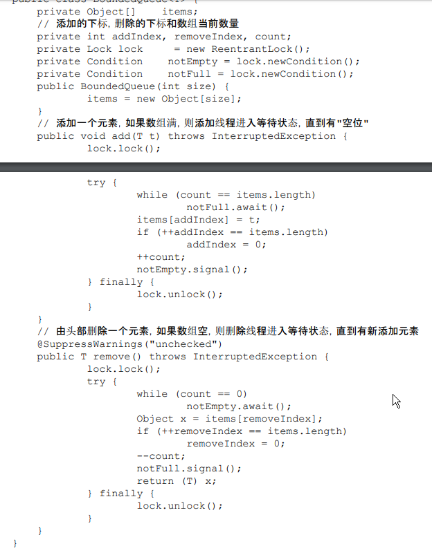
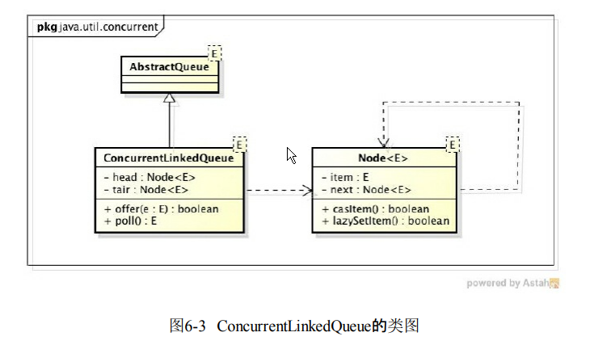
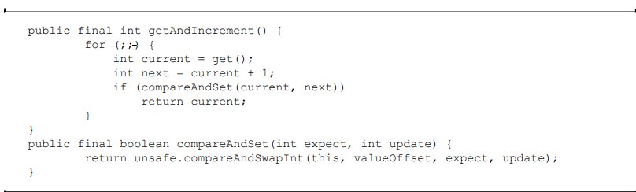
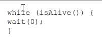
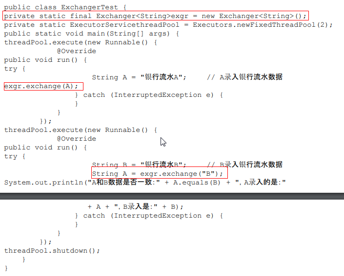

# 并发编程艺术 {ignore}
[toc]

## 第一章 并发编程的挑战

### 1.1 上下文的切换

即使单核处理器支持多线程执行代码，CPU通过给每一个线程分配CPU时间片（几十ms）段来实现多线程的机制。来回切换线程（保存和加载过程）会有开销。

### 1.2 死锁
定义：两个或多个线程同时等待对方释放锁时，会产生死锁。
避免方法：
- 避免一个线程同时获得多个锁。
- 避免一个线程在锁内同时占用多个资源，尽量保证一个锁只占用一个资源。
- 使用定时锁，lock.tryLock(timeout)。
- 对数据库锁，加锁和解锁必须在一个数据库连接里，否则会出现解锁失败的情况。

### 1.3 资源限制

## 第二章 java并发机制的底层实现原理
java代码编译后会变成字节码，字节码被类加载器加载到JVM里，JVM执行字节码最终转化为汇编在CPU上执行。

### 2.1 volatile的应用

1. colatile的定义与实现原理
- 定义：如果一个变量被声明为volatile,所有线程看到这个变量的只是一致的。

CPU的术语定义


- 实现原理：
在对声明了volatile变量进行读写操作时，JVM会向处理器发送一条Lock前缀指令，Lock前缀指令的作用：
（1）Lock前缀指令会引起处理器将缓存写到内存中。
（2）一个处理器的缓存写到内存会导致其他处理器的缓存无效。

2. volatile 的使用优化
**一个对象引用占四个字节**
追加64个字节能够提高并发效率，因为追加64个字节使得队列的头和尾不在同一个高速缓存行内，修改头或尾时只会锁定整个缓冲行，从而使得一个队列的头和尾可以同时被访问修改。

### 2.2 synchronized的实现原理
**重量级锁**
- synchronized实现同步的基础：java中的每一个对象都可以作为锁。
    - 对于普通同步方法，锁时当前**实例对象**
    - 对于静态同步方法，锁是当前类的**class对象**
    - 对于同步方法块，锁是**Sychronized括号里面配置的对象**
    当以一个线程访问同步代码块时，他首先需要获得锁，退出或抛出异常时必须释放锁。

JVM基于进入和退出Monitor对象来实现方法同步和代码块同步。但实现细节不一样，代码块同步是使用monitorenter和monitorexit指令来实现。
monitorenter指令在编译后插入到同步代码块开始位置，而monitorexit指令插入到方法借宿和异常出，jvm要保证每一个monitorenter必须有一个对应的monitorexit与之配对。任何一个对象都有一个monitor与之关联，当一个monitor被持后，它将处与锁定状态。线程执行到monitorenter指令时，将会尝试获取对应monitor的所有权，即尝试获得对象的锁。

&emsp;&emsp;**总结：sychronized关键字会使得代码在编译后将插入monitorenter和monitorexit指令。每一个对象都有与之关联的monitor对象，当线程执行到monitorenter指令时，将会尝试获取monitor的所有权，即获得锁，执行到monitorexit时，将会释放锁。monitorenter与monitorexit成对存在。**

2.2.1 Java对象头
&emsp;&emsp;sychronized用的锁是存在Java对象头里面的。
数组对象头：3个字宽存储对象头 32位虚拟机一个字宽4个字节。
非数组对象：2个字宽存储对象头 64位虚拟机一个字宽8个字节

2.2.2 锁的升级
为减小获得锁和释放锁带来的性能消耗，1.6以后引入偏向锁和轻量级锁。
锁的级别：无锁状态$\longrightarrow$偏向锁状态$\longrightarrow$轻量级锁状态$\longrightarrow$重量级锁状态。
**随竞争激烈程度提升，但只能升级，不能降级**
1. 偏向锁
当一个线程来访问锁时，会在头对象和栈帧中的所记录里存储锁偏向的线程ID，以后该线程在进入和退出同步代码块时不需要尽进行Compare and Swap（CAS）操作来加锁解锁。只需测试对象头中的MARk Word里是否存储着指向当前线程的线程锁。如果测试成功，则表示该线程已经获得锁，如果测试失败，则测试Mark Word中的偏向锁标识是否设置为1，若果没有，则使用CAS竞争锁，如果设置了，则尝试使用CAS将对象头指向该线程。
-偏向锁的撤销
当有其他线程尝试竞争锁的时候偏向锁的持有线程才会释放锁，偏向锁的撤销需要在全局安全点（没有字节码执行）时间上才能进行。
2. 轻量级锁
- 轻量级加锁：
在线程在执行同步代码块之前，JVM会现在当前线程的栈帧中创建用于存储所记录的空间，并且将对象头中的MArk Word复制到锁记录中。然后线程尝试使用将CAS将对象头中的Mar看word替换成指向锁记录的指针。若果成功，当前线程获得锁，否则表示其他线程竞争锁，当前线程便尝试使用自旋来获取锁。
**每一个访问同步代码块的线程，将对象头中的Mark Word复制到线程的Display Mark word 中，成功则获得锁，否则自选取锁。**
- 轻量级解锁：
轻量级解锁时，会使原子的CAS操作将会Display Mark Word替换回到对象头Mark Word，若果成功，则表示没有竞争发生。若果失败，则表示当前锁存在竞争，锁就会膨胀成重量级锁。
**当某个线程执行完同步体后，会将Display Mark Word替换到对象头的Mark Word，若果没有线程竞争，则直接替换成功，否则替换失败，升级为重量级锁**

锁的优缺点：
锁|优点|缺点|适应场景
:-:|:-:|:-:|:-:
偏向锁|加锁解锁不需要额外消耗，执行同步代码块和非同步代码块相比仅存在纳秒级差别|若果出现锁的竞争，会带来额外撤销消耗|单线程访问同步代码块场景
轻量级锁|竞争时线程不会阻塞，提高程序的相应速度|若果始终无法获取锁则会消耗CPU资源|追求响应时间同步代码块执行速度非常快
重量级锁|竞争线程不适用自旋，不会消耗CPU|线程阻塞，相应时间缓慢|追求吞吐量，同步代码块执行速度较慢

### 2.3 原子操作的实现原理
原子操作：不可中断的一个或一系列操作
1. 术语定义

术语名称|解释
:-:|:-:
缓存行|缓存的最小操作单位
比较和交换|CAS操作，比较新旧数值是否有变化，有则发生交换
CPU流水线|指令处理流水线，一个CPU时钟内完成一条指令
内存顺序冲突|一般由假共享引起，假共享是指多个CPU同时修改同一缓存行的不同部位而引起其中一个CPU的操作无效，当出现内存顺序冲突时，CPU必须清空流水线

2. 处理器如何实现原子操作
32位IA-32处理器使用基于对**缓存加锁**和**总线加锁**的方式来实现多处理器之间的原子操作。
- 总线加锁：当一个线程处理一个变量时，会在总线上释放一个lock信号，当其他处理器请求访问内存时会被阻塞，实现独占共享资源。（**大家都别取数据**）
- 缓存锁定：锁定缓存行，执行完操作时修改内部的内存地址，并使用缓存一致性时其他CPU缓存无效。

CAS实现原子操作的三大问题
(1) ABA问题，解决：在变量前追加版本号
(2) 循环时间长，开销大。如果自旋CAS长时间不成功，会给CPU带来非常大的执行开销。解决：使用pause指令延时流水线，避免在退出循环因内存冲突引起CPU流水线被清空
(3) 只能保证一个共享变量的原子操作

## 第三章 java内存模型

### 3.1 Java内存模型的基础
3.1.1 并发模型的两个关键问题
线程间的**通信**和**同步**问题。
线程通信机制：
- 共享内存：公共状态
- 消息传递：线程之间发送消息

- 同步：用于控制不同线程间发生相对顺序的机制

3.1.2 Java内存模型的抽象结构
所有示例，静态域和数组元素都存在堆中，对在线程之间共享。
局部变量，方法定义参数和异常处理参数不会在线程之间共享，每一个线程都有自己的本地内存（local memory）存放共享变量的副本，本地内存是JVM的一个抽象概念，并不是真实的存在的。

3.1.3 从源代码到指令序列的重排序
（1）编译器优化的重排序，编译器在不改变单线程语义的情况下，可以重新安排语句顺序。
（2）指令级并行的重排序
（3）内存系统的重排序

3.1.4 并发编程的模型分类

3.15. happens-before：前一个操作（执行结果）对后一个操作可见。

### 3.2 重排序
编译器和处理器为优化程序性能而对指令进行重排序。
3.2.1 数据依赖性
若果两个操作同时访问同一个变量，而这两个操作有一个为写操作，则这两个操作之间存在数据依赖。

3.2.2 as-if-serial语义：不管怎么重排序（单线程）程学的执行结果不能改变。
编译器和处理器不会对存在数据依赖的操作进行重排序。

3.2.4 多线程中，若存在控制依赖的操作重排序，可能会改变程序的执行结果。

### 3.3 顺序一致性
3.3.1 数据竞争：一个线程写一个变量的同时另一个线程读同一个变量，并且读写没有同步排序。
3.3.2 顺序一致性内存模型
- 一个线程中的所有操作必须按照程序的顺序来执行
- 不管是否同步，所有线程都只能看到一个单一的操作顺序，在顺序一致性模型中，每一个操作都必须是原子执行并且对所有线程可见。（任何时间只能有一个线程能够连接到该内存）。

**JVM中语序临界区内重排序**

3.3.4 最小安全性
JVM不保证未同步程序的执行结果和该程序在顺序一致性模型中的执行结果一致。保证执行结果一致需要禁止大量的编译器，处理器的优化。

每次处理器的和内存之间的数据传输都是通过一系列步骤来完成：总线事务。总线会同步试图并发执行的总线事务。

### 3.4 volatile 的内存语义
volatile声明的变量，可以看成对改变量的单个读写做了同步。
具有特性：
- 可见性
- 原子性

当写一个volitile变量时，JVM会把该线程的本地缓存共享变量刷新到主内存
当读一个volatile变量时，JVM会对应本地的内存无效化。

3.4.4 内存语义的实现
屏障插入策略：（防止重排序影响结果）
·在每个volatile写操作的前面插入一个StoreStore屏障。
·在每个volatile写操作的后面插入一个StoreLoad屏障。
·在每个volatile读操作的后面插入一个LoadLoad屏障。
·在每个volatile读操作的后面插入一个LoadStore屏障。


### 3.5 锁的内存语义

3.5.1 锁的释放-获取建立的happens-before的关系
锁除了让临界区互斥执行以外，还可以让释放锁的线程向获取同一锁的线程发送消息。

**锁的释放和获取总结**
- 线程a释放一个锁，实质上是线程a向接下来要获取这个锁的某个线程发出了信息（a线程对共享变量锁做的修改）
- 线程b获得锁，实质上是线程b接受到某线程发出释放锁的消息（修改消息）

3.5.3 
- lock指令执行时会锁住总线。
- 禁止该指令与之前和之后的续写指令进行重排序
- 刷新缓存

### 3.6 final域的内存语义
3.6.1 final域的重排序规则
（1）在构造函数内对一个final域的写入，与之随后把这个被构造对象的引用赋值给一个变量，这两个操作不可重排序。
（2）初次读一个包含final域的引用，与随后初次读这个final域，这两个操作之间不能重排序

### 3.7 happens-before
JMM向程序员提供的happens-before规则
JMM其实是在遵循一个基本原则：只要不改变程序的执行结果（指的是单线程程序和正确同步的多线程程序），
编译器和处理器怎么优化都行。

3.7.3 happens-before规则
1）程序顺序规则：一个线程中的每个操作，happens-before于该线程中的任意后续操作。
2）监视器锁规则：对一个锁的解锁，happens-before于随后对这个锁的加锁。
3）volatile变量规则：对一个volatile域的写，happens-before于任意后续对这个volatile域的
读。
4）传递性：如果A happens-before B，且B happens-before C，那么A happens-before C。
5）start()规则：如果线程A执行操作ThreadB.start()（启动线程B），那么A线程的
ThreadB.start()操作happens-before于线程B中的任意操作。
6）join()规则：如果线程A执行操作ThreadB.join()并成功返回，那么线程B中的任意操作
happens-before于线程A从ThreadB.join()操作成功返回。

### 3.8 双重检查锁定与延迟初始化
双重检查锁定是常见的延迟初始化技术。

3.8.1 双重检查锁定的由来
有时候可能需要推迟该开销对象的初始化过程，并且只有使用这些对象才进行初始化。


### 3.9 java内存模型总结

3.9.1 处理器的内存模型
顺序一致性内存模型是一个理论参考模型，实际上jvm和处理器会进行重排序，提高执行效率。

## 第四章 java并发编程基础

线程作为操作系统的调度的最小单元。  
### 4.1 线程介绍
4.1.1 什么是线程
启动一个java程序，操作系统就会创建一个java进程。现代操作系统调度的最小单元是线程，也叫轻量级进程。
一个线程可以创建多个线程，每一个线程都有自己的计数器，堆栈和局部变量等属性。并且可以同时访问共享内存变量。
```java
    //获取java线程管理MXBean
        ThreadMXBean threadMXBean = ManagementFactory.getThreadMXBean();
        //不要获取同步的monitor和synchronizer信息，仅获取线程和线程堆栈信息
        ThreadInfo[] threadInfos = threadMXBean.dumpAllThreads(false,false);
        for (ThreadInfo threadInfo :
                threadInfos) {
            System.out.println("[" + threadInfo.getThreadId() + "]" + threadInfo.getThreadName());
        }
```
结果：
[6]Monitor Ctrl-Break
[5]Attach Listener
[4]Signal Dispatcher
[3]Finalizer
[2]Reference Handler
[1]main

4.1.2 为什么要使用多线程
1. 更多的处理核心
2. 更快的响应时间
3. 更好的编程模型

4.1.3 线程的优先级
现代操作系统基本采用**时分形式**调度运行的线程。线程会被系统分配多个时间片段，当先线程的时间片段用完了就会发生线程调度。

java通过 int priority来控制优先级，优先级范围：1-10，在线程构建时可以通过setPriority(int )方法来修改优先级，默认优先级为：5 。

4.1.4 线程的状态
1. NEW:初始状态，线程被构建，但是还没调用start()方法
2. RUNNAble：运行运行状态，java线程将操作系统的就绪状态和运行状态两钟头状态统称为“运行中”
3. BLOCKED：阻塞状态，表示线程阻塞与锁
4. WAITING：等待状态，改状态需要等待其他线程做出一些特定动作（通知或中断）
5. TIME_WAITING：超时等待，指定时间自动返回
6. TERMINATTED：终止状态，表示当前线程已经执行完毕。

线程变迁图：


4.1.5 Daemon线程
Daemon线程是一中支持线程，主要被用于程序后台调度以及支持性工作。

注意：构建Daemon线程时，不能依靠finally来进行资源关闭，因为java虚拟机退出时不会执行Daemon的finally块不会被执行。

### 4.2 启动或终止线程

4.2.2 启动线程
调用start()方法：当前线程（即parent线程）同步告知java虚拟机，只要线程规划器空闲，立即启动调用start()方法的线程。

4.2.3 理解中断
其他线程通过调用该线程的**interrupt()**方法对其进行中断操作。
线程通过检查自己是否被中断来进行响应，通过isInterrupted()方法来进行判断。

4.2.4 过期的suspend()、resume()和stop() 占用资源不释放，容易引起死锁。

4.2.5 通过标志位或中断方式来终止线程，可以让线程在终止时有机会去清理资源，而不是武断的将线程停止，安全退出。

```java
public class Shutdown {
    public static void main(String[] args) throws Exception {
        Runner one = new Runner();
        Thread countThread = new Thread(one, "CountThread");
        countThread.start();
// 睡眠1秒，main线程对CountThread进行中断，使CountThread能够感知中断而结束
        TimeUnit.SECONDS.sleep(1);
        countThread.interrupt();
        Runner two = new Runner();
        countThread = new Thread(two, "CountThread");
        countThread.start();
// 睡眠1秒，main线程对Runner two进行取消，使CountThread能够感知on为false而结束
        TimeUnit.SECONDS.sleep(1);
        two.cancel();
    }
    private static class Runner implements Runnable {
        private long i;
        private volatile boolean on = true;
        @Override
        public void run() {
            while (on && !Thread.currentThread().isInterrupted()){
                i++;
            }
            System.out.println("Count i = " + i);
        }
        public void cancel() {
            on = false;
        }
    }
}
```

### 4.3 线程之间的通信
**每一个线程都有自己的栈空间**

4.3.1 volatile和synchronized关键字
在线程访问一个对象或成员变量时，由于每一个变量都可以拥有这个变量的拷贝，所以线程看到的不一定是最新的变量。

- volatile：告知程序，在任何时候该变量都要从共享空间中获取，改变则必须刷新。
ex：表示程序是否运行的变量boolean on = true;
- synchronized：可以修饰方法或者代码块。只能有一个线程处于同步块中，保证了线程访问变量的的可见性和排他性。

获取对象的monitor才能进入同步代码块，否则阻塞。

4.3.2 等待/通知机制
等待/通知相关方法定义在Object类中。

1. 使用wait(),notify()and notifyAll()需要对调用对象加锁
2. 使用wait()方法后，线程进入等待序列，放弃锁。
3. notify(),notifyAll()调用后，等待线程依旧不会先从wait()返回，需要调用notyfy(),notifyAll()的线程释放锁之后，等待线程才有机会被唤醒
4. notify()将一个等待线程从等待序列移动到同步序列,notifyAll()
5. 从wait()方法返回的前提是获得了代用对象的锁

等待方遵循的原则：
1. 获取锁对象
2. 如果条件不满足，那么调用对象的wait()方法，被通知后仍要检查
3. 条件满足则执行对应的逻辑

通知方遵循的原则：
1. 获得对象的锁
2. 改变条件
3. 通知所有等待在对象的线程

4.3.4 管道输入/输出流
与普通文件不同之处是：管道输入输出流用于线程之间的数据传输
PipedOutputStream
PipedInputStream
PipedReader
PipedWriter

- 使用前必须先绑定输入和输出流，否则抛出IOException
- 创建线程对象时传入 PipedReader 对象，

```java
 public class Piped {
    public static void main(String[] args) throws Exception {
        PipedWriter out = new PipedWriter();
        PipedReader in = new PipedReader();
        // 将输出流和输入流进行连接，否则在使用时会抛出IOException
        out.connect(in);//绑定流
        Thread printThread = new Thread(new Print(in), "PrintThread");
        printThread.start();
        int receive = 0;
        try {
            while ((receive = System.in.read()) != -1) {
                out.write(receive);
            }
        } finally {
            out.close();
        }
    }
    static class Print implements Runnable {
        private PipedReader in;
        public Print(PipedReader in) {
            this.in = in;
        }
        public void run() {
            int receive = 0;
            try {
                while ((receive = in.read()) != -1) {
                    System.out.print((char) receive);
                }
            } catch (IOException ex) {}
        }
    }
}

```

4.3.5 Thread.join()的使用
若果线程A执行了thread.join()方法，则当前线程A等待thread线程终止以后才从thread.join()返回。
join(long millis) //超时返回
join(long millis,int nanos) //超时返回

B线程执行 A.join()，则B线程要等A线程执行完毕才执行。

join()方法有加锁，循环，处理三个逻辑步骤。

4.3.5 ThreadLocal的使用
ThreadLocal，即**线程变量**，是一个以ThreadLocal对象为键，任意对象为值的存储结构。这个结构被附带在线程上，也就是说一个线程可以根据ThreadLocal对象来查询绑定在这个线程上的一个值。

通过set(T),get(T)来设置和获取值

### 4.4 线程应用实例

4.4.1 等待超时模式
```java
// 对当前对象加锁
public synchronized Object get(long mills) throws InterruptedException {
    long future = System.currentTimeMillis() + mills;
    long remaining = mills;
    // 当超时大于0并且result返回值不满足要求
    while ((result == null) && remaining > 0) {
        wait(remaining);
        remaining = future - System.currentTimeMillis();
    }
    return result;
}
```
1. wait()的作用是让当前线程进入等待状态，同时，wait()也会让当前线程释放它所持有的锁。“直到其他线程调用此对象的 notify() 方法或 notifyAll() 方法”，当前线程被唤醒(进入“就绪状态”)

2. notify()和notifyAll()的作用，则是唤醒当前对象上的等待线程；notify()是唤醒单个线程，而notifyAll()是唤醒所有的线程。

3. wait(long timeout)让当前线程处于“等待(阻塞)状态”，“直到其他线程调用此对象的notify()方法或 notifyAll() 方法，或者超过指定的时间量”，当前线程被唤醒(进入“就绪状态”)。

4.4.2 一个简单的数据连接池示例

连接池的定义：构造函数初始化连接的最大上限，通过一个双向队列来维护，调用方需要调用fetchConnection(long) 方法来指定多少毫秒内超时获取连接，当连接使用完成后，需要调用releaseConnection(Connection)方法来讲连接放回连接池。

```java
public class ConnectionPool {
    private LinkedList<Connection> pool = new LinkedList<Connection>();
    public ConnectionPool(int initialSize) {
        if (initialSize > 0) {
        for (int i = 0; i < initialSize; i++) {
            pool.addLast(ConnectionDriver.createConnection());
            }
        }
        }
        public void releaseConnection(Connection connection) {
            if (connection != null) {
                synchronized (pool) {
                    // 连接释放后需要进行通知，这样其他消费者能够感知到连接池中已经归还了一个连接
                    pool.addLast(connection);
                    pool.notifyAll();
                }
            }
        }/
        / 在mills内无法获取到连接，将会返回null
        public Connection fetchConnection(long mills) throws InterruptedException {
        synchronized (pool) {
        // 完全超时
            if (mills <= 0) {
                //等到有连接时直接返回
                while (pool.isEmpty()) {
                    pool.wait();
                }
                return pool.removeFirst();
            } else {
                long future = System.currentTimeMillis() + mills;
                long remaining = mills;
                while (pool.isEmpty() && remaining > 0) {
                    //这一步是不是有问题？？ 应该为1000
                    pool.wait(remaining);
                    remaining = future - System.currentTimeMillis();
                }
                Connection result = null;
            if (!pool.isEmpty()) {
                result = pool.removeFirst();
            }
            return result;
            }
        }
    }
}
```

4.4.3 线程池技术及其示例
线程池技术解决了每处理一个问题都要创建一个线程问题，将任务交给线程池，线程池来安排线程执行，线程池件相当于（一个车间管理员，线程就是工人，任务就是工作订单）
线程池：预先创建若干线程，并且不能由用户对线程进行直接操作。本质一个任务列表和一个同步线程数组
优点：消除了频繁创建和消亡线程的系统开销，面对过量的任务提交能够平缓的劣化。
线程池的接口定义
```java
public interface ThreadPool<Job extends Runnable>{
    //执行一个Job，这个job需要需要实现Runable接口
    void execute(Job job);
    //关闭线程池
    void shutdown();
    //增加工作者线程
    void addWorkers(int num);
    //减少工作者线程
    void removeWprker(int num);
    //得到正等待执行的任务数量
    int getJobSize();
}
```

线程池默认实现：本质一个任务列表和一个同步线程数组
```java

public class DefaultThreadPool<Job extends Runnable> implements ThreadPool<Job> {
    // 线程池最大限制数
    private static final int MAX_WORKER_NUMBERS = 10;
    // 线程池默认的数量
    private static final int DEFAULT_WORKER_NUMBERS = 5;
    // 线程池最小的数量
    private static final int MIN_WORKER_NUMBERS = 1;
    // 这是一个工作列表，将会向里面插入工作
    private final LinkedList<Job> jobs = new LinkedList<Job>();
    // 工作者列表
    private final List<Worker> workers = Collections.synchronizedList(new ArrayList<Worker>());
    // 工作者线程的数量
    private int workerNum = DEFAULT_WORKER_NUMBERS;
    // 线程编号生成，线程安全计数类
    private AtomicLong threadNum = new AtomicLong();

    public DefaultThreadPool() {
        initializeWokers(DEFAULT_WORKER_NUMBERS);
    }

    public DefaultThreadPool(int num) {
        workerNum = num > MAX_WORKER_NUMBERS MAX_WORKER_NUMBERS : num < MIN_WORKER_NUMBERS MIN_WORKER_NUMBERS : num;
        initializeWokers(workerNum);
    }
    public void execute(Job job) {
        if (job != null) {
        // 添加一个工作，然后进行通知
            synchronized (jobs) {
                jobs.addLast(job);
                jobs.notify();
            }
        }
    }
    public void shutdown() {
        for (Worker worker : workers) {
            worker.shutdown();
        }
    }
    public void addWorkers(int num) {
        synchronized (jobs) {
            // 限制新增的Worker数量不能超过最大值
            if (num + this.workerNum > MAX_WORKER_NUMBERS) {
                num = MAX_WORKER_NUMBERS - this.workerNum;
            }
            initializeWokers(num);
            this.workerNum += num;
        }
    }
    public void removeWorker(int num) {
        synchronized (jobs) {
            if (num >= this.workerNum) {
                throw new IllegalArgumentException("beyond workNum");
            }
            // 按照给定的数量停止Worker
            int count = 0;
            while (count < num) {
                Worker worker = workers.get(count)
                if (workers.remove(worker)) {
                    worker.shutdown();
                    count++;
                }
            }
            this.workerNum -= count;
        }
    }
    public int getJobSize() {
        return jobs.size();
    }
    // 初始化线程工作者
    private void initializeWokers(int num) {
        for (int i = 0; i < num; i++) {
            Worker worker = new Worker();
            workers.add(worker);
            Thread thread = new Thread(worker, "ThreadPool-Worker-" + threadNum.incrementAndGet());
            thread.start();
        }
    }
}
// 工作者，负责消费任务
class Worker implements Runnable {
    // 是否工作
    private volatile boolean running = true;
    public void run() {
        while (running) {
            Job job = null;
            synchronized (jobs) {
                // 如果工作者列表是空的，那么就wait
                while (jobs.isEmpty()) {
                    try {
                        jobs.wait();
                    } catch (InterruptedException ex) {
                        // 感知到外部对WorkerThread的中断操作，返回
                        Thread.currentThread().interrupt();
                        return;
                    }
                }
                // 取出一个Job
                job = jobs.removeFirst();
            }
            if (job != null) {
                try {
                    job.run();
                } catch (Exception ex) {
                    // 忽略Job执行中的Exception}
                }
            }
        }
    }
    public void shutdown() {
         running = false;
    }
}

```

4.4.4 一个基于线程池技术的简单Web服务器系统

```java

public class SimpleHttpServer {
    // 处理HttpRequest的线程池
    static ThreadPool<HttpRequestHandler> threadPool = new DefaultThreadPool<HttpRequestHandler>(1);
    // SimpleHttpServer的根路径
    static String basePath;
    static ServerSocket serverSocket;
    // 服务监听端口
    static int port = 8080;
    
    public static void setPort(int port) {
        if (port > 0) {
            SimpleHttpServer.port = port;
        }
    }

    public static void setBasePath(String basePath) {
        if (basePath != null && new File(basePath).exists() && new File(basePath).isDirectory()) {
            SimpleHttpServer.basePath = basePath;
        }
    }

    // 启动SimpleHttpServer
    public static void start() throws Exception {
        serverSocket = new ServerSocket(port);
        Socket socket = null;
        while ((socket = serverSocket.accept()) != null) {
            // 接收一个客户端Socket，生成一个HttpRequestHandler，放入线程池执行
            threadPool.execute(new HttpRequestHandler(socket));
        }
        serverSocket.close();
    }

    static class HttpRequestHandler implements Runnable {
        private Socket socket;
        public HttpRequestHandler(Socket socket) {
            this.socket = socket;
        }

        @Override
        public void run() {
            String line = null;
            BufferedReader br = null;
            BufferedReader reader = null;
            PrintWriter out = null;
            InputStream in = null;
            try {
                reader = new BufferedReader(new InputStreamReader(socket.getInputStream ());
                String header = reader.readLine();
                // 由相对路径计算出绝对路径
                String filePath = basePath + header.split(" ")[1];
                out = new PrintWriter(socket.getOutputStream());

                // 如果请求资源的后缀为jpg或者ico，则读取资源并输出
                if (filePath.endsWith("jpg") || filePath.endsWith("ico")) {
                in = new FileInputStream(filePath);
                ByteArrayOutputStream baos = new ByteArrayOutputStream();
                int i = 0;
                while ((i = in.read()) != -1) {
                    baos.write(i);
                }

                byte[] array = baos.toByteArray();
                out.println("HTTP/1.1 200 OK");
                out.println("Server: Molly");
                out.println("Content-Type: image/jpeg");
                out.println("Content-Length: " + array.length);
                out.println("");

                socket.getOutputStream().write(array, 0, array.length);
                } else {
                    br = new BufferedReader(new InputStreamReader(new
                    FileInputStream(filePath)));
                    out = new PrintWriter(socket.getOutputStream());
                    out.println("HTTP/1.1 200 OK");
                    out.println("Server: Molly");
                    out.println("Content-Type: text/html; charset=UTF-8");
                    out.println("");
                    while ((line = br.readLine()) != null) {
                        out.println(line);
                    }
                }
                out.flush();
            } catch (Exception ex) {
                out.println("HTTP/1.1 500");
                out.println("");
                out.flush();
            } finally {
                close(br, in, reader, out, socket);
            }
        }
    } 
    // 关闭流或者Socket
    private static void close(Closeable... closeables) {
        if (closeables != null) {
            for (Closeable closeable : closeables) {
                try {
                    closeable.close();
                } catch (Exception ex) {
                }
            }
        }
    }
}

```
接受到任务交给线程池处理，异步返回。


## 第五章 Java中的锁

### 5.1 Lock接口
一般来说，一个锁能够防止多个线程同时访问共享资源，但有些锁允许过线程并发访问共享资源，比如读写锁。
**java1.5之后加入Lock接口**，与synchronized关键字有相似的同步功能，但是需要**显示获取和释放锁**

锁的使用：
```java

Lock lock = new ReentrantLock();
lock.lock();//不要把获取锁放在try中，因为如果在获取锁（自定义锁的实现）发生了异常，抛出异常时会使锁无故释放。
try{
    //todo
}finally{
    lock.unlock();
}
```

lock锁提供synchronized不具备的特性：
- 尝试阻塞式地获取锁
- 能被中断地获取锁 获得锁的线程可以被中断并且释放锁。
- 超时获取锁

Lock接口提供的基本操作：
```java
class Lock{
    //阻塞式获取锁
    void lock()；
    //线程中断
    void lockinterruptibly() throws InterruptException;
    //尝试非阻塞式获取锁，立即返回获取结果
    boolean tryLock();
    //超时获取锁
    boolean tryLock(long time,TimeUnit unit) throws InterrruptException;
    void unlock();
    //获取等待通知组件
    Condition newCondition();
}
```

### 5.2 队列同步器 
AbstractQueuedSynchronizer,是用来构建锁和其他同步组建的基础框架。使用int成员变量表示同步状态，并且通过内置FIFO队列来完成组员获取线程的排队工作。（本质是一个线程链表，调用Lock方法本质是调用的同步器方法）

5.2.1 队列同步器的接口与示例

5.2.2 同步队列的实现与分析
1. 同步队列 
同步队列依赖内部的同步队列（FIFO双向队列）来完成同步状态的管理。当前线程获取同步状态失败时，同步器会将当前队列线程以及等待状态信息构成一个节点（Node）并加入到同步队列里，同时会阻塞当前线程，当同步锁释放会把首节点中的线程唤醒，使用再次尝试获取同步状态。
**失败将线程阻塞封装到FIFO队列等待释放锁再由首节点尝试获取同步状态**
首节点是获取同步状态成功的节点，首节点的线程释放同步状态时，将会唤醒后续节点，而后续节点会在获取同步状态成功时将自己设置为首节点。

2. 独占式同步状态获取和释放
acquire(int arg)方法可以获取该同步状态的，该方法对中断不敏感。当线程获取同步队列失败而进入同步队列中，后续对线程进行终端操作时，线程不会退出队列。
acquire(int arg)方法调用流程图


3. 共享式同步状态获取与释放
与独占式想相比，主要区别在于同一时刻能否有多个线程同时获取到同步状态。读操作可以共享式访问，写操作要求为独占式访问。

通过调用acquireShare(int arg) 方法可以共享使获取同步状态。
通过调用releaseShared(int arg)方法可以释放同步状态。

4. 独占式超时获取同步状态
通过调用doAcquireNanos(int arg , long nanosTimeout) 方法可以超时获取同步状态，及指定时间段内获取同步状态，成功返回true,否则返回 false。
doAcquireNano方法调用流程


5. 自定义同步组件---TwinsLock
需求：该工具在同一时刻只允许最多两个线程同时访问，超过两个线程的访问将被阻塞。
必须重写tryAcquireShared(int args)方法和tryReleaseShared(int args)方法
同步资源数：2个，可是设置初始状态status为2，当一个线程进行获取时减1，线程释放则加1。同步状态变更时需要使用compareAndSet(int expect,int update)方法保证原子性。

```java

public class TwinsLock implements Lock {
    private final Sync sync = new Sync(2);

    public void lock() {
        sync.acquireShared(1);
    }
    public void unlock() {
        sync.releaseShared(1);
    }
    // 其他接口方法略

    private static final class Sync extends AbstractQueuedSynchronizer {
        Sync(int count) {
            if (count <= 0) {
                throw new IllegalArgumentException("count must large than zero.");
            }
            setState(count);
        }

        public int tryAcquireShared(int reduceCount) {
            for (;;) {
                int current = getState();
                int newCount = current - reduceCount;
                if (newCount < 0 || compareAndSetState(current,newCount)) {
                    return newCount;
                }
            }
        }

        public boolean tryReleaseShared(int returnCount) {
            for (;;) {
                int current = getState();
                int newCount = current + returnCount;
                if (compareAndSetState(current, newCount)) {
                    return true;
                }
            }
        }
    }
}

```

### 5.3 重入锁
即支持重新进入的锁，
- 表示该锁能够支持一个线程对资源重复加锁。
- 还支持获取锁时的公平性和非公平性选择

**等待时间长的线程有线获取锁--公平获取**

1. 实现重进入
**重进入：一个线程在获取到锁之后能够再次获取该锁而不被阻塞。**

线程再次获取锁：锁需要识别该线程是否为当前锁的占据线程，是才能获取
锁的最终释放：线程重复n次获取了锁，需要n次释放，其他线程才能获取到该锁。

ReentranLock 组合定义同步器来实现锁的获取和释放。
同步状态为0时，锁完全释放。

2. 公平与非公平获取锁的区别
非公平锁效率高

### 5.4 读写锁

排他锁：同一时刻只允许一个线程访问
读写锁：读线程可以多个访问，写线程排他

**读写锁维护了一个读锁和写锁。**

并发包提供的读写锁：ReentrantReadWriteLock
具有特性：
- 公平选择性：支持公平和非公平获取锁的方式
- 重进入：支持重进入
- 锁降级：写锁能降级为读锁

5.4.1 读写锁的接口与示例
ReadWriteLock接口，提供两个方法readLock()和writeLock()方法
ReentrantReadWriteLock还提供了监控内部工作状态的方法

缓存示例说明读写锁的使用方法：
```java

public class Cache {
    static Map<String, Object> map = new HashMap<String, Object>();
    //获取读写锁
    static ReentrantReadWriteLock rwl = new ReentrantReadWriteLock();
    //获取读锁
    static Lock r = rwl.readLock();
    //获取写锁
    static Lock w = rwl.writeLock();
    // 获取一个key对应的value
    public static final Object get(String key) {
        r.lock();
        try {
            return map.get(key);
        } finally {
            r.unlock();
        }
    }
    // 设置key对应的value，并返回旧的value
    public static final Object put(String key, Object value) {
        w.lock();
        try {
            return map.put(key, value);
        } finally {
            w.unlock();
        }
    }
    // 清空所有的内容
    public static final void clear() {
        w.lock();
        try {
            map.clear();
        } finally {
            w.unlock();
        }
    } 
}

```
总结：ReentrantReadWriteLock对象可以获取读写锁。

5.4.2 读写锁的实现与分析
读写锁的实现：依赖自定义同步器，读写状态就是同步器的同步状态。

读写状态确定：由一个32位的二进制数确定。高16为为读状态，低16位为写状态，当有读或写状态增加时，S = S + 0x00000001或S = S + 0x00010000;

2. 写锁的获取与释放
写锁是一个支持重进入的排他锁。写锁的释放与ReentrantLock的释放过程基本类似。

3. 读锁的获取与释放
读锁是一个支持冲进入的共享锁，他能被多个线程同时获取，并且在没有其他写线程访问时，读锁的获取总是成功，只是增加读状态。若获取读锁时有写锁被获取，则进入等待状态。

4. 降级锁
锁降级是的是写锁降级成为读锁。降级锁是指把持住写锁，再获取读锁，随后释放写锁的过程。
作用：保证数据的可见性。

### 5.5 LockSupport工具
提供了一组用于线程阻塞和唤醒的静态方法。
- **park开头用来阻塞线程**
    void park() 阻塞当前线程，调用unpark 或者线程被中断，才能从park()返回。
    void parkUntil(long deadline):定时阻塞
    void parkNanos(long deadline):超时阻塞
- **unpark(Thread thread)方法来唤醒阻塞线程。**
    void unpark(Thread nthread):唤醒处于阻塞状态的线程

java 6新增park(Object blocker),parkNanos(Object blocker,long nanos),parkUnytil(Object blocker,long deadline)。

### 5.6 Condition接口
任意一个java对象都拥有一组监视器方法（在java.lang.Object上），主要包括wait(),wait(long timeout),notify()and notifyAll()。
**Condition接口也提供看Object的监视器方法，与Lock配合实现等待/通知模式。**

5.6.1 Condition接口与示例
- **Condition对象的创建：Condition condition= Lock.newCondition()**
    condition.await():释放锁进入等待
    condition.signal():唤醒等待的线程
    condition.signalAll():唤醒所有在Condition上等待的线程。
- **调用前需要获取锁**
使用示例：

有界序列：


5.6.2 Condition的实现与分析
**每一个Condition对象都包含一个队列（等待队列）。**
1. 等待队列（FIFO）
2. 等待
**调用Condition的await()方法会使当前线程进入等待队列，并且释放锁**。将获取锁的同步队列的首节点直接加入等待队列中。
condition.signal():唤醒等待时间最长的节点。

## 第六章 Java迸发容器和框架

### 6.1 ConcurrentHashMap 的实现原理和使用

**ConcurrentHashMap 线程安全的 HashMap。**

6.1.1 为什么使用ConcurrentHashMap
- **HashMap线程不安全**
并发情况下，put操作回引起死循环(多线程会使Entry链表行程环形数据结构)。ex:

- **HashTable 效率低下**(因为HashTable 使用synchronized来保证线程安全，在put时不能执行其他操作) 
- **ConcurrentHashMap使用锁的分段技术，有效的提高并发访问率**
    将数据分段存储，然后分别配置一把锁。

6.1.2 ConcurrentHashMap的结构
- **Segment 数组：一个，是一种数组链表结构**。一个Segment包含一个HashEntry数组。对HashEntry数据进行操作之前必须先获取该Segment的锁。
**数组链表结构：数组的元素是链表**

- **HashEntry是一个链表结构元素**

ConcurrentHashMap数据结构：


6.1.3 ConcurrentHashMap的初始化
1. 初始化Segments数组
**Segment数组的长度为：concurrentLevel的最小2的N次方的值（利用安位预与的散列算法来定位Segments的索引）**
2. **初始化SegmentShift和SegmentMask**
3. **初始化每一个Segment**

6.1.4 定位segment （使用散列算法）
**使用Wang/Jenkins hash的变种算法对元素的hashCode进行一次再散列。之所以进行再散列，目的是减少散列冲突，使元素能够均匀地分布在不同的Segment上，从而提高容器的存取效率。**


6.1.5 ConcurrentHashMap的操作

1. **get （不用加锁）**
Segment的get操作实现非常简单和高效。先经过一次再散列，然后使用这个散列值通过散
列运算定位到Segment，再通过散列算法定位到元素，代码如下。


2. **put**
put方法首先定位到Segment，然后在Segment里进行插入操作。插入操作需要经历两个步骤，
- **第一步判断是否需要对Segment里的HashEntry数组进行扩容**，
- **第二步定位添加元素的位置，然后将其放在HashEntry数组里**。首先会创建一个容量是原来容量两倍的数组，然后将原数组里的元素进行再散列后插入到新的数组里。为了高效，**ConcurrentHashMap不会对整个容器进行扩容**，而只对某个segment进行扩容。

3. **size**
**ConcurrentHashMap的做法是先尝试2次通过不锁住Segment的方式来统计各个Segment大小，如果统计的过程中，容器的count发生了变化，则再采用加锁的方式来统计所有Segment的大小。**
用modCount变量判断容器是否发声变化。（在put、remove和clean方法里操作元素前都会将变量modCount进行加1）

### 6.2 ConcurrentLinkedQueue 安全队列

6.2.1 ConcurrentLinkedQueue的结构：


6.2.2 入队列
1. 入队列就是将入队节点添加到队列的尾部。
第一是定位出尾节点；第二是使用CAS算法将入队节点设置成尾节点的next节点，如不成功则重试。

2. 定义尾节点
tail 节点并一定是尾节点

4. ** 以doug lea使用hops变量来控制并减少tail节点的更新频率，并不是每次节点入队后都将tail节点更新成尾节点，而是当tail节点和尾节点的距离大于等于常量HOPS的值（默认等于1）时才更新tail节点，**

6.2.3 出队列
首先获取头节点的元素，然后判断头节点元素是否为空，如果为空，表示另外一个线程已经进行了一次出队操作将该节点的元素取走，如果不为空，则使用CAS的方式将头节点的引用设置成null，如果CAS成功，则直接返回头节点的元素，如果不成功，表示另外一个线程已经进行了一次出队操作更新了head节点，导致元素发生了变化，需要重新获取头节点。

### 6.3 java中的阻塞队列

6.3.1 什么是阻塞队列 （不能进行操作时阻塞）
1）支持阻塞的插入方法：意思是当队列满时，队列会阻塞插入元素的线程，直到队列不满。
2）支持阻塞的移除方法：意思是在队列为空时，获取元素的线程会等待队列变为非空。

在阻塞队列不可用时，这两个附加操作提供了4种处理方式：
- **抛出异常**：当队列满时，如果再往队列里插入元素，会抛出IllegalStateException（"Queue full"）异常。当队列空时，从队列里获取元素会抛出NoSuchElementException异常。
- **返回特殊值**：当往队列插入元素时，会返回元素是否插入成功，成功返回true。如果是移除方法，则是从队列里取出一个元素，如果没有则返回null。
- **一直阻塞**
- **超时退出**

6.3.2 Java里的阻塞队列
JDK 7提供了7个阻塞队列:
- ArrayBlockingQueue：一个由数组结构组成的有界阻塞队列。
- LinkedBlockingQueue：一个由链表结构组成的有界阻塞队列。
- PriorityBlockingQueue：一个支持优先级排序的无界阻塞队列。
- DelayQueue：一个使用优先级队列实现的无界阻塞队列。
- SynchronousQueue：一个不存储元素的阻塞队列。SynchronousQueue是一个不存储元素的阻塞队列。每一个put操作必须等待一个take操作，否则不能继续添加元素。
- LinkedTransferQueue：一个由链表结构组成的无界阻塞队列。
- LinkedBlockingDeque：一个由链表结构组成的双向阻塞队列。

6.3.3 阻塞队列的实现原理
- 使用通知模式实现，所谓通知模式，就是当生产者往满的队列里添加元素时会阻塞住生产者，当消费者消费了一个队列中的元素后，会通知生产者当前队列可用。

### 6.4 Fork/Join框架
**Fork/Join框架是Java 7提供的一个用于并行执行任务的框架**


6.4.2 工作窃取算法
**工作窃取（work-stealing）算法是指某个线程从其他队列里窃取任务来执行。**

- 工作窃取算法的优点：充分利用线程进行并行计算，减少了线程间的竞争
- 工作窃取算法的缺点：在某些情况下还是存在竞争，比如双端队列里只有一个任务时。并且该算法会消耗了更多的系统资源，比如创建多个线程和多个双端队列。

6.4.3 Fork/Join框架的设计
- 步骤1 **分割任务**：不停地分割，直到分割出的子任务足够小

- 步骤2 **执行任务并合并结果：**。分割的子任务分别放在双端队列里，然后几个启动线程分别从双端队列里获取任务执行。子任务执行完的结果都统一放在一个队列里，启动一个线程从队列里拿数据，然后合并这些数据。

- ForkJoin任务的创建：**继承ForkJoinTask的子类**（通常不需要直接继承ForkJoinTask）
**RecursiveAction：用于没有返回结果的任务。**
**RecursiveTask：用于有返回结果的任务。**

- ForkJoinPool：ForkJoinTask需要通过ForkJoinPool来执行。

6.4.4 使用Fork/Join框架

```java
public static void main(String[] args) {
    ForkJoinPool forkJoinPool = new ForkJoinPool();
    CountTask task = new CountTask(1, 4);
    Future<Integer> result = forkJoinPool.submit(task);
}
```
**使用递归思想**：
在这个方法里，首先需要判断任务是否足够小，如果足够小就直接执行任务。如果不足够小，就必须分割成两个子任务，每个子任务在调用fork方法时，又会进入compute方法，看看当前子任务是否需要继续分割成子任务，如果不需要继续分割，则执行当前子任务并返回结果。使用join方法会等待子任务执行完并得到其结果。

6.4.5 Fork/Join框架的异常处理


6.4.6 Fork/Join框架的实现原理
ForkJoinPool由ForkJoinTask数组和ForkJoinWorkerThread数组组成，ForkJoinTask数组负责将存放程序提交给ForkJoinPool的任务，而ForkJoinWorkerThread数组负责执行这些任务。

- （1）ForkJoinTask的fork方法实现原理
当我们调用ForkJoinTask的fork方法时，程序会调用ForkJoinWorkerThread的pushTask方法异步地执行这个任务，然后立即返回结果。pushTask方法把当前任务存放在ForkJoinTask数组队列里。然后再调用ForkJoinPool的
signalWork()方法唤醒或创建一个工作线程来执行任务。

- （2）ForkJoinTask的join方法实现原理
Join方法的主要作用是阻塞当前线程并等待获取结果，
它调用了doJoin()方法，通过doJoin()方法得到当前任务的状态来判断返回什么结果，任务状态有4种：已完成（NORMAL）、被取消（CANCELLED）、信号（SIGNAL）和出现异常（EXCEPTIONAL）。
·如果任务状态是已完成，则直接返回任务结果。
·如果任务状态是被取消，则直接抛出CancellationException。
·如果任务状态是抛出异常，则直接抛出对应的异常。

在doJoin()方法里，首先通过查看任务的状态，看任务是否已经执行完成，如果执行完成，则直接返回任务状态；如果没有执行完，则从任务数组里取出任务并执行。如果任务顺利执行完成，则设置任务状态为NORMAL，如果出现异常，则记录异常，并将任务状态设置为EXCEPTIONAL。


## 第七章 java中的13个原子操作

java.util.concurrent.atomic包中的原子操作类提供了一种简单高效线程安全的更新标量方式。
13个类，四种类型的原子更新方式。

### 7.1 原子更新基本类型类

- AtomicBoolean
- AtomicInteger
- AtomicLong
三种类型用法一样

以AtomicInteger为例：
方法|描述
:-:|:-:
**int addAndGet（int delta）**|以原子方式将输入的数值与实例中的值（AtomicInteger里的value）相加，并返回结果。
**boolean compareAndSet（int expect，int update）**|如果输入的数值等于预期值，则以原子方式将该值设置为输入的值。
**int getAndIncrement()**|以原子方式将当前值加1，注意，这里**返回的是自增前的值**。
**void lazySet（int newValue）**|最终会设置成newValue，使用lazySet设置值后，可能导致其他线程在之后的一小段时间内还是可以读到旧的值。
**int getAndSet（int newValue）**|以原子方式设置为newValue的值，并返回旧值。

getAndIncrement()实现原理：

修改前判断值是否被修改(判断当前值是否=之前获取的当前值)。其他基本类型，底层通过转化为Intger或Long实现的。

### 7.2 原子更新数组
原子方式更新数组，Atomic包提供了4个类。
AtomicIntegerArray
AtomicLongArray
AtomicReferenceArray
AtomicIntegerArray
方法|描述
:-:|:-:
int addAndGet（int i，int delta）|以原子方式将输入值与数组中索引i的元素相加。返回结果。
boolean compareAndSet（int i，int expect，int update）|如果当前值等于预期值，则以原子方式将数组位置i的元素设置成update值。
方法使用相同，以AtomicIntegerArray为例：

注：数组value通过构造方法传递进去，然后AtomicIntegerArray会将当前数组复制一份，所以当AtomicIntegerArray对内部的数组元素进行修改时，不会影响传入的数组。

### 7.3 原子更新引用类型
Atomic包提供了以下3个类：

AtomicReference：原子更新引用类型
AtomicReferenceFieldUpdater：原子更新引用类型里的字段
AtomicMarkableReference：原子更新带有标记位的引用类型。可以原子更新一个布尔类型的标记位和引用类型。构造方法是AtomicMarkableReference（V initialRef，boolean initialMark）。

以AtomicReference为例：


### 7.4 原子更新字段类
AtomicIntegerFieldUpdater
AtomicLongFieldUpdater
AtomicStampedReference：原子更新带有版本号的引用类型。该类将整数值与引用关联起来，可用于原子的更新数据和数据的版本号，可以解决使用CAS进行原子更新时可能出现的ABA问题。

原子更新字段步骤：
- 因为原子更新字段类都是抽象类，每次使用的时候必须使用静态方法newUpdater()创建一个更新器，并且需要设置想要更新的类和属性
- 更新类的字段（属性）必须使用public volatile修饰符。

以AstomicIntegerFieldUpdater为例:


## 第八章 Java中的并发开发工具

CountDownLath,CyclicBarrier和Semaphore:并发6流的控制
Exchanger工具类：线程间交换数据

### 8.1 等待多线程完成的CountDownLatch
**CountDownLath允许一个或多个线程等待其他线程完成操作**
join()方法：当前线程等待join线程执行结束
实现原理：不停检查join程序是否存活


CountDownLath使用示例：

CountDownLatch构造时接受一个int N类的参数作为计数器。们调用CountDownLatch的countDown方法时，N就会减1,直到=0。CountDownLatch的await方法会阻塞当前线程，直到N变成零，（超时等待await（long time，TimeUnit unit））。
也就是说：**CountDownLacth的awai方法会阻塞当前线程，直到CountDownLatch计数器为0为止。CountDownLatch中的 countDown会时技术器减一。**

### 8.2 同步屏障CyclicBarrier
作用：**让一个线程到达一个屏障（同步点）时被阻塞。**

**8.2.1 CyclicBarrier简介**
默认构造方法：CyclicBarrier(int parties) // parties:拦截线程数量，每个线程调用await()告诉当前线程已经到达屏障，然后阻塞。
本质：**指定数量的线程在屏障点一起执行。若到达屏障点的线程数量小于parties，则到达线程都要等待。**

CyclicBarrier（int parties，Runnable barrierAction）//当线程都到达屏障时，先执行barrierAction


**8.2.3 CyclicBarrier和CountDownLatch的区别**
- CountDownLatch的计数器只能使用一次，而CyclicBarrier的计数器可以使用reset()方法重置
- CyclicBarrier还提供其他有用的方法，比如getNumberWaiting方法可以获得Cyclic-Barrier阻塞的线程数量。isBroken()方法用来了解阻塞的线程是否被中断

### 8.3 控制并发线程数的Semaphore
Semaphore（信号量）是用来控制同时访问特定资源的**线程数量**，对某资源同时操作的线程数量进行限制。
应用场景：数据库连接
ex：一共30个线程，只允许10个线程同时连接到数据库。

Semaphore构造函数：Semaphore(int permits) // permits允许线程数量
用法：acqiure()获取可许证
      release()释放可许证

其他方法：
- int availablePermits()：返回此信号量中当前可用的许可证数。
- int getQueueLength()：返回正在等待获取许可证的线程数。
- boolean hasQueuedThreads()：是否有线程正在等待获取许可证。
- void reducePermits（int reduction）：减少reduction个许可证，是个protected方法
- Collection getQueuedThreads()：返回所有等待获取许可证的线程集合，是个protected方法。

### 8.4 线程间交换数据的Exchanger
在一个同步点，两个线程可以进行数据交换。


若两个线程有一个没有执行exchange()方法，则另一个线程会一直等待。为避免这种情况，可使用超时等待：
exchange（V x，long timeout，TimeUnit unit）

## 第九章 Java中的线程池
合理利用线程池的作用：
- **降低资源消耗**：通过重复利用已创建的线程降低线程创建和销毁造成的消耗
- **提高响应速度**：当任务到达时，任务可以不需要等到线程创建就能立即执行
- **提高线程的可管理性**

### 9.1 线程池的实现原理
1. 判断核心线程池内的线程是否都在执行任务，如果不是，则创建一个新的工作线程来执行任务。如果核心线程池里的线程都在执行任务，则进行下一步。
2. 判断工作队列是否已满，若果没有满则存入工作队列。若工作队列已满，则进行下一步。
3. 线程池判断池中线程是否在都处于工作状态，若没有则创建一个新的工作线程来执行任务。

本质：**提交一个任务时，若核心线程池没空，则存入队列，若队列已满，则判断线程池所有线程是否都处于工作状态，是则交给饱和策略处理，否则创建新的线程执行。目的：避免获取全局锁**

ThreadPoolExcutor的execute()方法执行示意图：

1）如果当前运行的线程少于corePoolSize，则创建新线程来执行任务（注意，执行这一步骤需要获取全局锁）。
2）如果运行的线程等于或多于corePoolSize，则将任务加入BlockingQueue。
3）如果无法将任务加入BlockingQueue（队列已满），则创建新的线程来处理任务（注意，执行这一步骤需要**获取全局锁**）。
4）如果创建新线程将使当前运行的线程超出maximumPoolSize，任务将被拒绝，并调用
RejectedExecutionHandler.rejectedExecution()方法。


线程池创建线程时，会将线程封装成工作线程Worker，Worker在执行完任务后，还会**循环获取工作队列里的任务**来执行。


1）**在execute()方法中创建一个线程时，会让这个线程执行当前任务。**
2）这个线程执行完上图中1的任务后，**会反复从BlockingQueue获取任务来执行**。

### 9.2 线程池的使用

**9.2.1 线程池的创建**
创建线程池：
```java

ThreadPoolExecutor threadPool = new ThreadPoolExecutor(corePoolSize,maximumPoolSize,keepAliveTime,millseconds,runnableTaskQueue,handler);
```
**corePoolSize** 核心线程池大小，来一个任务就创建一个线程，直到核心线程池满为止。huihuiprestartAllCoreThreads()，提前创建所有核心线程。
**maximumPoolSize** 最大线程池数量
**keepAliveTime** （线程活动保持时间）：线程池的工作线程空闲后，保持存活的时间。所以，如果任务很多，并且每个任务执行的时间比较短，可以调大时间，提高线程的利用率。
**TimeUnit**（线程活动保持时间的单位）：可选的单位有天（DAYS）、小时（HOURS）、分钟（MINUTES）、毫秒（MILLISECONDS）、微秒（MICROSECONDS，千分之一毫秒）和纳秒（NANOSECONDS，千分之一微秒）。
**millseconds** 毫秒
**runnableTaskQueue** 任务队列，可选择如下几种阻塞队列：
ArrayBlockingQueue : 数组型阻塞队列有界，FIFO
LinkedBlockingQueue ：链表型阻塞有界队列，FIFO，吞吐量通常要高于ArrayBlockingQueue。静态工厂方法Executors.newFixedThreadPool()使用了这个队列
SynchronousQueue ：一个不存储元素的阻塞队列。每个插入操作必须等到另一个线程调用移除操作，否则插入操作一直处于阻塞状态，吞吐量通常要高于Linked-BlockingQueue，静态工厂方法Executors.newCachedThreadPool使用了这个队列。
PriorityBlockingQueue：一个具有优先级的无限阻塞队列。
**handler**

**ThreadFactory**：用于设置创建线程的工厂，可以通过线程工厂给每个创建出来的线程设置更有意义的名字。使用开源框架guava提供的ThreadFactoryBuilder可以快速给线程池里的线

**RejectedExecutionHandler（饱和策略）**：当队列和线程池都满了，说明线程池处于饱和状态，那么必须采取一种策略处理提交的新任务。这个策略默认情况下是AbortPolicy，表示无法处理新任务时抛出异常。
java 1.5中提供了4种策略
- AbortPolicy：直接抛出异常。
- CallerRunsPolicy：只用调用者所在线程来运行任务。
- DiscardOldestPolicy：丢弃队列里最近的一个任务，并执行当前任务。
- DiscardPolicy：不处理，丢弃掉。

**9.2.2 向线程池提交任务**
**execute()** : 提交**不需要返回的任务**，无法判断任务是否被执行


**submit() **：提交**需要返回的任务**，返回Future类型的对象。使用get()方法会阻塞当前线程直到任务完成，而使用get（long timeout，TimeUnit unit）方法则会阻塞当前线程一段时间后立即返回，这时候有可能任务没有执行完。


**9.2.3 关闭线程池**
threadPool.shutdown();将线程池的**状态设置成shutdown**，然后**中断**所有没有正在执行任务的线程。
threadPool.shutdownNow();首先将线程池的状态设置成**STOP**，然后**尝试停止所有的正在执行或暂停任务的线程，并返回等待执行任务的列表**，如果任务不一定要执行完，则可以调用shutdownNow方法。
原理：遍历线程池的工作线程，逐个使用interrupt来中断线程。

**9.2.4 合理地配置线程池**

**9.2.5 线程池的监控**
**taskCount**：线程池需要执行的**任务数量**。
**completedTaskCount**：线程池在运行过程中**已完成的任务数量**，小于或等于taskCount。
**largestPoolSize**：线程池里**曾经创建过的最大线程数量**。通过这个数据可以知道线程池是否曾经满过。如该数值等于线程池的最大大小，则表示线程池曾经满过。
**getPoolSize**：线程池的**线程数量**。如果线程池不销毁的话，线程池里的线程不会自动销毁，所以这个大小只增不减。
**getActiveCount：获取活动的线程数。**

可以通过继承线程池来自定义线程池，重写线程池的beforeExecute、afterExecute和terminated方法，也可以在任务执行前、执行后和线程池关闭前执行一些代码来进行监控。