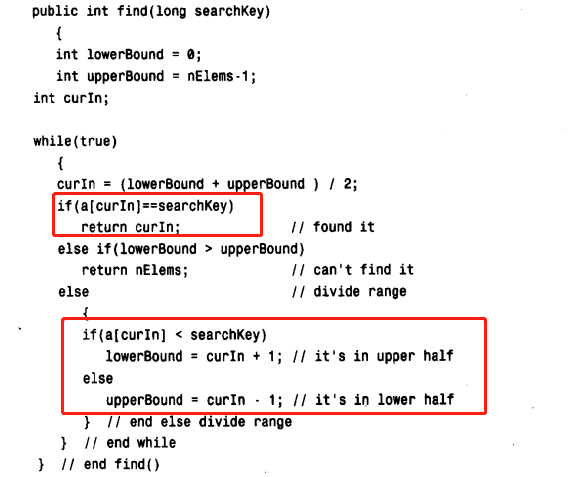
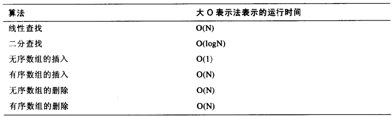

# 数据结构与算法 {ignore}
[toc]

## 第一章 综述

数据结构的特点

数据结构|优点|缺点
:-:|:-:|:-:
数组|插入快|查找，删除慢，固定大小
有序数组|比无序数组查找快|删除，插入慢，固定大小
栈|FISO|存取其他项很慢
队列|FIFO|存取其他项很慢
链表|查找，插入，删除都快|删除算法复杂
红黑树|查找，插入，删除都快，树总是平衡的|算法复杂
2-3-4 树|查找，插入，删除都快，树总是平衡的，对磁盘存储有用|算法复杂
哈希表|已知关键字则存取极快，插入块|删除慢，不知关键字则存取很慢，存储空间利用不充分
堆|插入快，删除快，对最大数据项存取很快|对其他数据项存取很慢
图|对现实世界建模|有些算法慢且复杂

## 第二章 数组
- 插入：向后順移
- 删除：向前順移

index 从0开始
初始化：元素为：null

HighArray:不考虑下标
- inset(element)：放在最后
- find(element))：逐个对比
- delete(element)：逐个对比

有序数组：
线性查找：发现值比自己大时放弃查找
二分查找：

大O表示法
- 无序数组
插入：T = K; K 一次插入需要的时间
线性查找：T = K*N/2; N为数据总项 ==> T = K*N
二分查找：T = K*log_2(N);
去掉常数：

## 第三章 简单排序